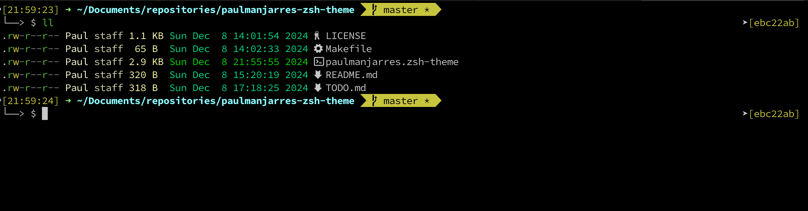

# paulmanjarres-zsh-theme

My personal ZSH theme.
Based on RubbyRussel, Agnoster, nuts.zsh-theme


## Installation
```
$ git clone https://github.com/paul-manjarres/paulmanjarres-zsh-theme.git
$ cd paulmanjarres-zsh-theme
$ make link
```

Edit .zshrc file and change ZSH_THEME to this:

```
$ cd ~/.zshrc
ZSH_THEME=paulmanjarres
```
## Screenshots
